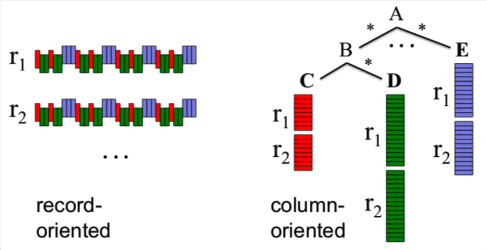
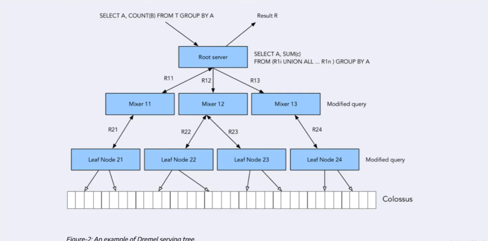

# Data Warehouses and BigQuery.

## Key Topics Covered

### OLAP vs OLTP
The video distinguishes between two database types. OLTP (Online Transaction Processing) is used for backend services with fast, small updates and normalized data - think customer-facing applications like online shopping. OLAP (Online Analytical Processing) is designed for analytical purposes, handling large datasets with periodic refreshes and denormalized structures, primarily used by data analysts and scientists.

### Data Warehouse Overview
A data warehouse is an OLAP solution used for reporting and data analysis. It typically aggregates data from multiple sources (operating systems, flat files, OLTP databases) into a staging area before loading into the warehouse. Users can access data through data marts or directly query raw data, providing flexibility for different analytical needs.

### BigQuery Advantages
BigQuery stands out as a serverless data warehouse solution that eliminates the need to manage servers or install database software. It offers seamless scalability from gigabytes to petabytes, separates compute from storage for cost efficiency, and includes built-in features for machine learning, geospatial data, and business intelligence queries.

### Cost Structure
BigQuery offers two pricing models:
- **On-demand pricing**: $5 per terabyte processed
- **Flat-rate pricing**: Starting at approximately $2,000 monthly for 100 slots (equivalent to ~400TB of processing)

On-demand pricing is recommended for most use cases under 200TB of monthly processing.

### Partitioning
Partitioning dramatically improves query performance and reduces costs by organizing data into segments based on a column (typically dates). The demonstration showed processing requirements dropping from 1.6GB to just 106MB when querying partitioned versus non-partitioned tables.

### Clustering
Clustering further optimizes performance by organizing data within partitions based on specified columns. When combined with partitioning, the example showed data processing reduced from 1.1GB to 843MB, demonstrating additional cost savings and performance improvements.

## Key Takeaways

1. BigQuery's serverless architecture eliminates infrastructure management overhead
2. Separating compute from storage provides significant cost advantages
4. Clustering adds an additional layer of optimization within partitions
5. Understanding your query patterns is essential for choosing the right partitioning and clustering strategy

# BigQuery Partitioning and Clustering.

## Partitioning Options

### Partition Types
You can partition by:
- Time unit column
- Ingestion time
- Integer range

### Time-Based Partitioning
BigQuery offers several time-based partitioning options:

- **Daily** (default): Best for medium-sized data distributed evenly across days
- **Hourly**: Use when processing huge amounts of data by the hour (watch the 4,000 partition limit)
- **Monthly**: Suitable for smaller datasets spread across longer time ranges
- **Yearly**: For data with very long time spans and lower volumes

**Important Limitation**: BigQuery has a maximum of 4,000 partitions per table. When using hourly partitions, implement an expiration strategy to avoid hitting this limit.

## Clustering Fundamentals

### How Clustering Works
Clustering co-locates data based on specified columns. The column order matters significantly because it determines the sort order. For example, clustering on columns A, B, C means data is sorted first by A, then B, then C.

### Best Use Cases for Clustering
- Improves performance for filter and aggregate queries
- Most effective when filtering on clustered columns
- Ideal for queries using multiple columns

### Clustering Specifications
- **Maximum columns**: Up to 4 clustering columns
- **Column requirements**: Must be top-level, non-repeated columns
- **Supported data types**: DATE, BOOLEAN, GEOGRAPHY, INT, NUMERIC, STRING, DATETIME

### When NOT to Use Clustering
Avoid partitioning and clustering for tables under 1GB. The metadata reads and maintenance costs can outweigh performance benefits for small datasets.

## Partitioning vs Clustering: Decision Guide

### Choose Partitioning When:
- **Cost predictability is crucial**: Partitioning shows upfront cost estimates before query execution
- **You need partition-level management**: Ability to delete, create, or move partitions between storage
- **Filtering on a single column**: Partitioning works on one column only
- **You want cost controls**: Can set query limits to prevent execution if costs exceed thresholds

### Choose Clustering When:
- **Cost benefits are less critical**: Clustering costs are unknown upfront
- **You need more granularity**: Beyond what partitioning can provide
- **Filtering on multiple columns**: Clustering supports multi-column queries
- **High cardinality data**: When columns have many distinct values
- **Partitions would be too small**: Less than 1GB per partition
- **Avoiding partition limits**: When you'd exceed 4,000 partitions
- **Frequent partition modifications**: When data updates would affect many partitions regularly

### Combine Both When:
Use partitioning and clustering together for optimal performance on large datasets with complex query patterns.

## Automatic Reclustering

BigQuery performs automatic reclustering in the background to maintain query performance. Key features:

- **Automatic maintenance**: Newly inserted data is automatically reorganized
- **No performance impact**: Runs in the background without affecting queries
- **Partition-aware**: For partitioned tables, clustering is maintained within each partition
- **Zero cost**: Completely free with no charges to users
- **Preserves sort order**: Prevents performance degradation from overlapping key ranges

This automatic process ensures that as new data is added, the clustering strategy remains effective without manual intervention.

## Key Takeaways

1. **Start with daily partitioning** as the default for time-based data
2. **Clustering order matters** - arrange columns by query filter priority
3. **Small tables don't benefit** from partitioning/clustering (< 1GB)
4. **4,000 partition limit** requires careful planning for hourly partitions
5. **Partitioning provides cost predictability** while clustering offers flexibility
6. **Automatic reclustering is free** and maintains performance automatically
7. **Combine strategies** for complex workloads with large datasets

# BigQuery Best Practices

## Cost Reduction

- Avoid SELECT *
- Price your queries before running them
- Use clustered or partitioned tables
- Use streaming inserts with caution
- Materialize query results in stages

## Query Performance

- Filter on partitioned/clustered columns
- Denormalizing data
- Use nested or repeated columns
- Use external data sources appropriately
- Don't use it, in case u want a high query performance
- Reduce data before using a JOIN
- Do not treat WITH clauses as prepared statements
- Avoid oversharding tables
- Avoid JavaScript user-defined functions
- Use approximate aggregation functions (HyperLogLog++)
- Order Last, for query operations to maximize performance
- Optimize your join patterns
- As a best practice, place the table with the largest number of rows first, followed by the table with the fewest rows, and then place the remaining tables by decreasing size.

# BigQuery: Internal Architecture. 

