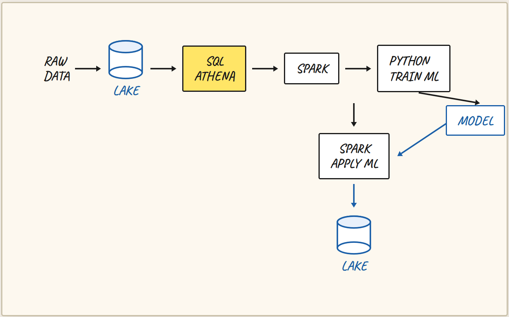
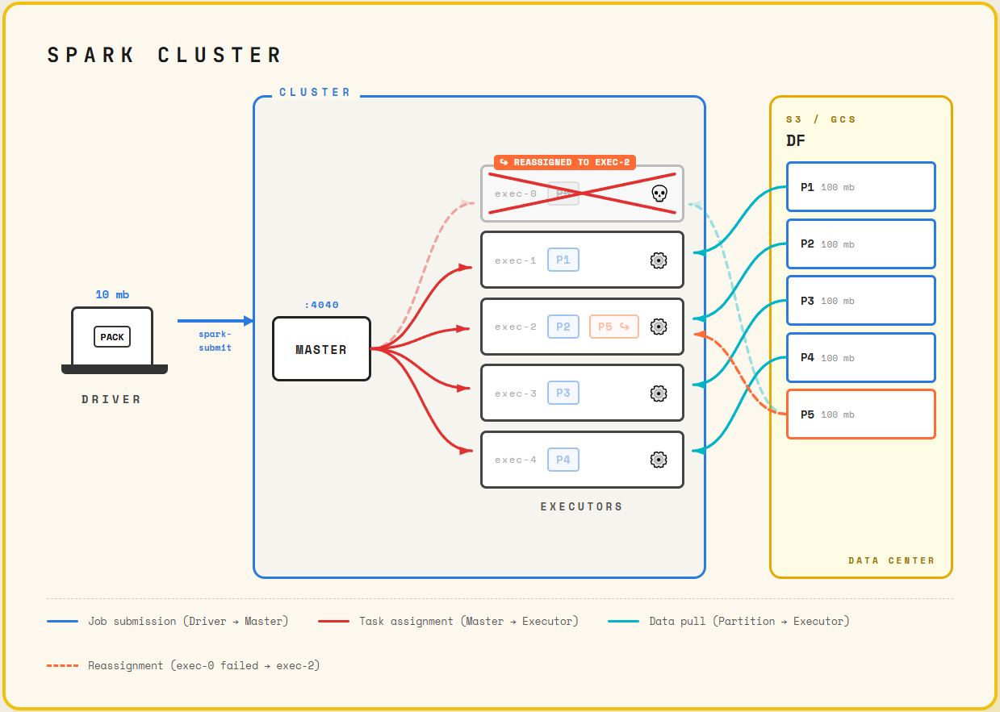

# Batch Processing

## Introduction to batch processing. 

### Overview

Week 5 focuses on **batch processing** and **Apache Spark**. Topics covered include:

- What batch processing is
- Introduction to Spark and why it's useful
- Installing Spark on Linux (via Google Cloud Platform VM)
- PySpark (Python API for Spark)
- Spark features: DataFrames, SQL, Joins, RDDs
- Running Spark with Docker
- Deploying Spark to the cloud
- Connecting Spark to a data warehouse

---

### Batch vs. Streaming

There are two main paradigms for processing data:

| | Batch | Streaming |
|---|---|---|
| **How it works** | Processes a large chunk of data all at once | Processes events in real time as they occur |
| **Example** | Processing all taxi trips from January 15th at end of day | Sending a trip-start event the moment a passenger boards |
| **Week covered** | Week 5 | Week 6 |


### Common Batch Job Intervals

- **Weekly** — process an entire week's worth of data
- **Daily** — most common; process everything from the previous day
- **Hourly** — process everything from the previous hour
- **Sub-hourly** — e.g., every 5 minutes (less typical)


### Technologies Used for Batch Processing

- **Python scripts** — e.g., the data ingestion pipeline built in Week 1
- **SQL / dbt** — transformations covered in Week 4
- **Apache Spark** — the focus of Week 5
- **Orchestration tools** (e.g., Airflow/Prefect) — used to chain batch steps into a pipeline


### Advantages of Batch Processing

- **Easy to manage** — workflow tools allow parameterization, scheduling, and retries
- **Safe to retry** — since processing isn't happening in real time, failures can be re-run cleanly
- **Easy to scale** — can increase machine size or add cluster nodes as data grows

### Disadvantage of Batch Processing

- **Delay** — data is only available after the batch window closes *and* the pipeline finishes executing. For example, an hourly job with a 20-minute pipeline means waiting ~80–90 minutes to act on data from the start of the previous hour.


### Why Batch Still Dominates

Despite the delay disadvantage, batch processing accounts for an estimated **80–90% of real-world data jobs**. Many business metrics are not time-sensitive enough to require streaming, making batch the practical and convenient default.

---

## Introduction to Spark: What is Apache Spark?

Apache Spark is a **multi-language engine for large-scale data processing**. The key word is *engine* — Spark pulls data from a source (data lake or database), processes it across its machines, and writes the results back to a data lake or warehouse.

- **Distributed** — can run on a cluster of tens to thousands of machines working in parallel
- **Multi-language** — natively written in Scala, but supports wrappers for:
  - **Python** (PySpark) — the most popular choice in practice
  - Java
  - R
- **Primarily for batch**, but can also handle streaming by treating a data stream as a sequence of small batches


### When Should You Use Spark?

Spark is typically used when your data lives in a **data lake** (e.g., AWS S3 or Google Cloud Storage) rather than a data warehouse.

### Decision Guide

| Situation | Recommended Tool |
|---|---|
| Data is in a data warehouse | BigQuery / SQL |
| Data is in a data lake, job expressible in SQL | Presto, Athena, Hive, or BigQuery external tables |
| Data is in a data lake, job **too complex for SQL** | **Apache Spark** |

> **Rule of thumb:** If you can express your job as a SQL query, use SQL. Use Spark when you need more flexibility.


### Common Use Cases for Spark

- Complex transformations that are difficult or impossible to express in SQL
- **Machine learning workflows**, including:
  - Pre-processing and feature engineering
  - Training ML models
  - Applying/scoring a trained model at scale


### A Typical Spark Workflow




## Anatomy of Spark cluster: 

### Local vs. Cluster Setup

- In previous lessons, Spark was run **locally** using `master = local[*]`, where everything executes on a single machine.
- In production, Spark runs on a **distributed cluster** with multiple machines working together.

---

### Spark Cluster Components

### 1. Driver
- The program that **submits a Spark job** to the cluster.
- Can be your **laptop**, an **Airflow task** (via `spark-submit`), or any other orchestration tool.

### 2. Spark Master
- Acts as the **coordinator** for the cluster.
- Receives jobs from the driver via **`spark-submit`**.
- Exposes a **Web UI** (typically on port `4040`) to monitor running jobs.
- Assigns tasks to executors and **reassigns work** if an executor fails.

### 3. Executors
- The machines that **perform the actual computation**.
- Each executor pulls a **partition** of data and processes it.
- Once a task is done, the executor picks up the next available partition.

### How Data is Processed

- A Spark **DataFrame** is split into many **partitions** (e.g., Parquet files).
- Each executor is assigned one partition at a time, processes it, and marks the task complete.
- Results are written back to **cloud storage** (e.g., S3, Google Cloud Storage).

### HDFS / Hadoop vs. Cloud Storage

| | Hadoop / HDFS | Modern Cloud Storage (S3, GCS) |
|---|---|---|
| **Data location** | Stored on executor nodes | Stored externally in cloud |
| **Key concept** | *Data locality* — send code to the data | Pull data to executors over network |
| **Rationale** | Avoids moving large files over the network | Fast intra-datacenter networking makes this negligible |
| **Popularity today** | Declining | Preferred approach |

- In the Hadoop era, the code (small, ~10 MB) was sent to the machine that already held the data (large, ~100 MB per partition) — this was called **data locality**.
- Today, Spark clusters and cloud storage typically reside in the **same data center**, making network reads fast enough that HDFS is no longer necessary.


### Summary

| Component | Role |
|---|---|
| **Driver** | Submits the Spark job (laptop, Airflow, etc.) |
| **Master** | Coordinates jobs and manages executor health |
| **Executors** | Execute computations on data partitions |
| **Cloud Storage** | Source and destination for data (S3, GCS, etc.) |



---

## GroupBy in Spark: 

### Group By: Two Stages

### Stage 1 — Local grouping per partition

Each executor pulls one partition and independently:

1. Filters records (e.g. discards pre-2020 data)
2. Runs a *partial* group by within that partition only

The result is a set of **intermediate-results** — partial aggregations that still need to be combined across partitions.

### Stage 2 — Reshuffling + final aggregation

Spark takes all sub-results and **reshuffles** them: records with the same key (hour + zone) are moved into the same partition. This is implemented internally using **external merge sort**, a distributed sorting algorithm.

Once all matching keys are co-located, each executor does a final aggregation — summing revenues and trip counts — producing one output record per unique key.

---

## Joins in Spark


### Join Type 1: Two Large Tables — Sort Merge Join

When both tables are roughly equal in size, Spark uses **Sort Merge Join**, which works similarly to the Group By shuffle process:

1. For every record in each partition, Spark creates a **(key, record)** pair using the join columns (hour + zone as a composite key)
2. **Reshuffling** happens — all records with the same key are moved to the same partition across both tables
3. Once co-located, matching records are merged into one wide row adding the columns for both datasets. For outer joins, unmatched records get `null` on the missing side

This involves significant data movement across the network, visible in the Spark UI as **shuffle read/write** metrics.


### Join Type 2: One Large + One Small Table — Broadcast Join

When one table is very small (e.g. a zones lookup table), Spark uses a completely different and much faster strategy:

1. The small table is **broadcast** — a full copy is sent to every executor
2. Each executor joins its partition of the large table against the in-memory copy of the small table
3. **No reshuffling needed** — the join happens locally on each executor

This results in just **one stage** instead of three, making it significantly faster. Spark detects this automatically and applies it without any manual configuration.

---

## Operations on Spark RDDs. 


## What Are RDDs?

**RDD** stands for **Resilient Distributed Dataset**. It is the foundational data structure in Spark — everything else, including DataFrames, is built on top of RDDs. An RDD is simply a **distributed collection of objects** (no schema, no structure enforced), partitioned across a cluster of executors.

> **Note:** This section is marked as **optional**. Modern Spark workflows use DataFrames and SQL, so direct RDD usage is mostly historical context — though some operations (like `mapPartitions`) remain useful today.


### RDDs vs. DataFrames

| Feature | RDD | DataFrame |
|---|---|---|
| Schema | None (raw objects) | Yes (enforced) |
| API | Low-level (map, filter, reduce) | High-level (SQL-like) |
| Use today | Rare / advanced use cases | Standard approach |


### Core RDD Operations

### 1. Accessing an RDD from a DataFrame
```python
rdd = df.rdd          # Access underlying RDD
rdd.take(5)           # Returns first 5 Row objects; rdds dont have .show() attribute 
```

### 2. `filter` — Equivalent to SQL `WHERE`
Keeps only records where the function returns `True`.

```python
from datetime import datetime

start = datetime(year=2020, month=1, day=1)

def filter_outliers(row):
    return row.lpep_pickup_datetime >= start

filtered_rdd = rdd.filter(filter_outliers)
```

### 3. `map` — Transform Each Record
Applied to every element; transforms an RDD into another RDD.

Used here to prepare records for `GROUP BY` by converting each row into a **(key, value)** tuple:

```python
def prepare_for_grouping(row):
    hour = row.lpep_pickup_datetime.replace(
        minute=0, second=0, microsecond=0
    )
    zone = row.PULocationID
    key = (hour, zone)
    value = (row.total_amount, 1)   # amount + count
    return (key, value)

mapped_rdd = filtered_rdd.map(prepare_for_grouping)
```

### 4. `reduceByKey` — Equivalent to SQL `GROUP BY` + Aggregation
Groups all records with the same key and combines their values:

```python
def calculate_revenue(left_value, right_value):
    left_amount, left_count = left_value
    right_amount, right_count = right_value
    return (left_amount + right_amount, left_count + right_count)

revenue_rdd = mapped_rdd.reduceByKey(calculate_revenue)
```

### 5. Unwrapping / Flattening the Result
After reduction, the nested tuple structure needs to be flattened back into a single row:

```python
def unwrap(row):
    return (row[0][0], row[0][1], row[1][0], row[1][1])
    # (hour, zone, total_revenue, count)

result_rdd = revenue_rdd.map(unwrap)
```

### 6. Converting Back to a DataFrame
Use a **NamedTuple** to restore column names and provide a schema:

```python
from collections import namedtuple
from pyspark.sql import types

RevenueRow = namedtuple('RevenueRow', ['hour', 'zone', 'revenue', 'count'])

result_schema = types.StructType([
    types.StructField('hour',    types.TimestampType(), True),
    types.StructField('zone',    types.IntegerType(),   True),
    types.StructField('revenue', types.DoubleType(),    True),
    types.StructField('count',   types.LongType(),      True),
])

df_result = result_rdd.toDF(schema=result_schema)
df_result.show()
```

### How Group By Works Internally (Two Stages)

```
Partition 1  --[map]-->  (key1, v), (key2, v), ...  ─┐
Partition 2  --[map]-->  (key1, v), (key3, v), ...  ─┤─[shuffle]─> key1 partition --> reduceByKey
Partition N  --[map]-->  (key2, v), (key3, v), ...  ─┘             key2 partition --> reduceByKey
```

1. **Stage 1:** `map` is applied to every record in each partition independently.
2. **Shuffle:** All records with the same key are moved to the same partition.
3. **Stage 2:** `reduceByKey` aggregates records within each partition.

This is the same two-stage execution model used by Spark SQL under the hood.

### Full Pipeline Summary

```
DataFrame
  └─ .select(columns).rdd
       └─ .filter(filter_outliers)       ← WHERE clause
            └─ .map(prepare_for_grouping) ← SELECT + key/value prep
                 └─ .reduceByKey(calculate_revenue) ← GROUP BY + SUM
                      └─ .map(unwrap)    ← flatten result
                           └─ .toDF(schema) ← back to DataFrame
```

### Key Takeaways

- RDDs are the **low-level building block** of Spark; DataFrames sit on top of them.
- Core operations: **`filter`**, **`map`**, **`reduceByKey`**.
- `reduceByKey` is called with a function that takes **two values** and returns one combined value.
- In modern Spark, you rarely need RDDs directly — but understanding them explains *why* Spark works the way it does.

---


## What is `mapPartitions`?

`mapPartitions` is an RDD operation similar to `map`, but instead of processing **one record at a time**, it processes an **entire partition at once**.

| Operation | Input | Output |
|---|---|---|
| `map` | One element | One element |
| `mapPartitions` | One partition (iterator) | One partition (iterator) |

This makes it ideal for workloads where spinning up a resource (like loading an ML model) per-record would be wasteful — you load it **once per partition** instead.


### Key Use Case: Batch ML Predictions

The primary motivation for `mapPartitions` is applying a **machine learning model** to a large dataset:

1. A large dataset (e.g. 1 TB) is split into partitions (e.g. 100 MB each).
2. Each partition is sent to an executor.
3. The ML model is loaded **once per partition** and runs predictions on the whole chunk.
4. Results are combined and saved to a data lake.

This avoids loading the model for every single row, which would be extremely slow.


### Example: Predicting Trip Duration

### Setup — Select Relevant Columns
```python
columns = ['VendorID', 'lpep_pickup_datetime', 'PULocationID', 'DOLocationID', 'trip_distance']
duration_rdd = df_green.select(columns).rdd
```

### The `mapPartitions` Function
The function receives a partition as an **iterator** (not a list), processes it, and **yields** results back one row at a time.

```python
import pandas as pd

def apply_model_in_batch(partition):
    # Convert partition (iterator of Rows) to a Pandas DataFrame
    rows = list(partition)
    df = pd.DataFrame(rows, columns=columns)

    # Apply model predictions
    predictions = model_predict(df)
    df['predicted_duration'] = predictions

    # Yield each row back as an iterable
    for row in df.drop(index=True).itertuples(index=False):
        yield row
```

### A Simple Stand-in "Model"
```python
def model_predict(df):
    # Placeholder: predict 5 minutes per mile of trip distance
    return df['trip_distance'] * 5
```

### Apply and Convert Back to DataFrame
```python
result_rdd = duration_rdd.mapPartitions(apply_model_in_batch)
df_predictions = result_rdd.toDF()
df_predictions.select('predicted_duration').show()
```


### Important Details

### The Function Must Return an Iterable
`mapPartitions` expects the function to return something iterable (a list, generator, etc.). Returning a single value will cause an error.

```python
# ❌ Wrong — not iterable
def bad_func(partition):
    return 1

# ✅ Correct — returns a list
def good_func(partition):
    return [1]

# ✅ Better — uses a generator with yield
def best_func(partition):
    for row in partition:
        yield transform(row)
```

### Partitions → Pandas DataFrames
Converting a partition to a Pandas DataFrame is straightforward:
```python
rows = list(partition)
df = pd.DataFrame(rows, columns=columns)
```
> ⚠️ **Caveat:** This loads the **entire partition into memory**. Make sure your executors have enough RAM. If not, consider repartitioning or using chunked processing (e.g. with Python's `itertools`).

### Counting Records Per Partition (Debugging Tip)
```python
def count_partition(partition):
    count = 0
    for _ in partition:
        count += 1
    yield count

duration_rdd.mapPartitions(count_partition).collect()
# e.g. [1100000, 350000, 200000, 150000]
```
Unbalanced partitions can cause performance issues — one executor finishes early while others are still processing.

---

### `yield` — A Quick Primer

`yield` turns a function into a **generator**, producing values lazily one at a time instead of building a full list in memory:

```python
def infinite_sequence():
    i = 0
    while True:
        yield i
        i += 1

gen = infinite_sequence()
next(gen)  # 0
next(gen)  # 1
next(gen)  # 2
```

Spark uses this pattern internally to stream results out of `mapPartitions` without materializing the whole output at once.

---

### When to Use `mapPartitions`

| Scenario | Use `mapPartitions`? |
|---|---|
| Applying an ML model to large datasets | ✅ Yes |
| Chunked batch processing | ✅ Yes |
| Loading an external resource once per partition | ✅ Yes |
| Simple per-row transformations | ❌ Use `map` instead |
| Standard aggregations / filtering | ❌ Use DataFrame API instead |

---

### Key Takeaways

- `mapPartitions` processes data in **chunks (partitions)**, not row-by-row.
- It is especially useful for **ML inference** and any operation with a costly setup step.
- The function must **return an iterable** — using `yield` is the idiomatic approach.
- For most everyday transformations, the **DataFrame API** is simpler and preferred.
- This concludes the optional Spark RDD internals section of the course.
